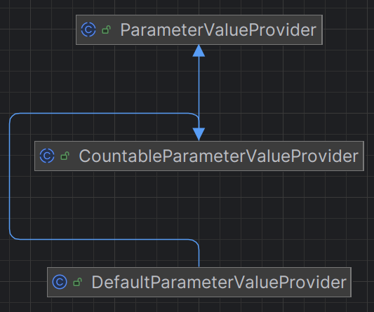

# Parameter Value Provider
This set of classes is used to provide a value to various parameters, based on different valuation methodologies. In the implementation of RestTestGen, we find two macro-types: **single** and **multiple** (i.e. combining several single strategies). 

## Single Strategy
Individual strategies include the classes: ```DefaultParameterValueProvider```, ```EnumParameterValueProvider```, ```ExamplesParameterValueProvider```, ```LastRequestDictionaryParameterValueProvider```, ```LastResponseDictionaryValueProvider```, ```RequestDictionaryParameterValueProvider```, ```ResponseDictionaryParameterValueProvider```. They all extend the ```CountableParameterValueProvider``` class, which in turn extends the abstract ```ParameterValueProvider``` class. An example of a hierarchy can be found in the figure below.



In addition, we also have the ```RandomParameterValueProvider``` and ```NarrowRandomParameterValueProvider``` classes that directly extend the ```ParameterValueProvider``` class. An example of the hierarchy is shown in the figure below.


The ```CountableParameterValueProvider```  class extends ``` ParameterValueProvider```  and introduces the concept of a deterministic, finite source of values. Thus, parameter values are not generated randomly but are taken from a predefined and finite set.   
The class offers three ways of determining the source of values: 
- **```SELF```**: values are only taken from the specific instance of the parameter. 
- **```SAME_NAME```**: values are extracted from all API parameters that have the same name.
- **```SAME_NORMALIZED_NAME```**: values are extracted from all parameters that have the same normalized name, i.e. a name treated uniformly to avoid variations due to different formatting. 

The ```CountableParameterValueProvider``` class also implements methods to collect parameters with the same name or the same normalised name, to filter out duplicate values and to eliminate those that do not conform to the parameter specification. When a value is requested, the class determines which values are available according to the configuration and chooses an appropriate value. If there are no values available, an exception is thrown; if only one value is available, it is returned directly; if there are multiple values, one is selected randomly. 

At the base of the hierarchy is the abstract class ```ParameterValueProvider```, which defines a common interface for all value providers. Each instance of this class must implement the ```provideValueFor()``` method, which, given a parameter, returns a value that can be used in tests. The class also includes the variable ```strict```, which determines whether values are to be subjected to stricter conformity checks.

Now let us look in detail at all the individual strategies.

### Default Parameter Value Provider
When a parameter is requested, the class attempts to retrieve the default values given in the OpenAPI specification. If the ```SAME_NAME``` mode is enabled, it collects the default values of all parameters with the same name; if the ```SAME_NORMALISED_NAME``` mode is enabled, it collects those with the same normalized name; in all other cases, it uses only the default value of the specific parameter. 

Once this is done, filters are applied to eliminate duplicates, and if the strict mode is enabled, values that do not conform to the specification of the parameter to be valued are discarded. The result is a set of values optimized for use in the various tests.

### Enum Parameter Value Provider
When a parameter is requested, this class uses the enumerated values (enum) defined in the OpenAPI specification. By default, only the values of the specific parameter are taken, however, it is also possible to set ```SAME_NAME``` or ```SAME_NORMALISED_NAME```.
The main method of the ```collectValuesFor(LeafParameter leafParameter)``` class is responsible for collecting the valid values for the parameter passed as an argument. This method determines the collection strategy based on the configuration of the value source:
- **```SAME_NAME```**: if the class is configured to use values from all parameters of the API with the same name (```SAME_NAME```), the method collects all enumerated values defined for parameters with the same name within the OpenAPI specification. The collection is done by extracting the enum values from each corresponding parameter, eliminating any duplicates. 
- **```SAME_NORMALIZED_NAME```***: collection is carried out by considering parameters that have the same normalised name. This helps to handle formatting variations in parameter names, ensuring that semantically equivalent parameters are treated in the same way. 
- **Default Mode (```SELF```)**: if neither of the two previous modes is activated, the provider directly uses the enumerated values defined for the parameter itself, without searching for other matches within the API specification.

### Examples Parameter Value Provider
When a parameter value is requested, the default example values in the OpenAPI specification are used. In this way, the example values are documented and realistic.   
The main method of the class is ```collectValuesFor(LeafParameter leafParameter)```, which collects the example values (examples) associated with the parameter passed as an argument. The collection strategy depends on the configuration of the value source: 
- **```SAME_NAME```**: if the configuration is set to ```SAME_NAME```, the method collects all example values defined for parameters having the same name within the OpenAPI specification. The values are extracted and any duplicates removed.   
- **```SAME_NORMALIZED_NAME```**: if the configuration is set to ```SAME_NORMALISED_NAME```, the collection is performed considering parameters that have the same normalised name. This allows standardisation of variations in the parameter name. 
- **Default Mode (```SELF```)**: if neither of the two previous modes is activated, the provider directly uses the example values defined for the parameter itself, without searching for matches within the API specification. 

### Last Request Dictionary Parameter Value Provider
A global dictionary is relied upon to value parameters with this technique. This contains the values collected from previous API requests, allowing the most recent data to be reused. By default, the provider uses the global dictionary of requests that is available in the Environment. This dictionary contains DictionaryEntries that associate parameters with specific values recorded during previous API requests. The constructor sets the mode ```SAME_NORMALISED_NAME```, which means that values will be collected not only from parameters with the same name, but also from those with the normalised name. 

The ```collectValuesFor(LeafParameter leafParameter)``` method collects the available values for a parameter, following these steps: 
- **Retrieval of values from the dictionary**: values are retrieved based on the exact name and values based on the normalised name are also retrieved.   
- **Filtering of non-conforming values**: if strict mode is active, entries containing values that do not conform to the parameter type and constraints are removed. 
- **Sorting of values by discovery date**: the collected values are sorted according to the discovery timestamp (```DictionaryEntry::getDiscoveryTime```) and the last available value, i.e. the most recent, is selected.   

The class provides the ```setDictionary(Dictionary dictionary)``` method, which allows the dictionary from which the values are taken to be changed, allowing for greater flexibility in the use of the provider.

### Last Response Dictionary Parameter Value Provider
Similar to the class described above, values from a dictionary are also used here. However, the values are taken from a global response dictionary, i.e. from data obtained from the answers of executed requests. By default, the class uses the global response dictionary which is available via ```Environment.getInstance()```. The constructor sets the ```SAME_NORMALISED_NAME``` mode, allowing values to be collected not only by the exact name of the parameter, but also by its normalised name. 

The ```collectValuesFor(LeafParameter leafParameter)``` method collects the available values for a given parameter by following these steps: 
- **Retrieval of values from the response dictionary**: values are retrieved based on the exact name of the parameter (```leafParameter.getName()```) and are also retrieved based on the normalised name (```leafParameter.getNormalisedName()```). 
- **Filtering of non-conforming values**: if strict mode is active, entries containing values that do not conform to parameter specifications are removed. 
- **Sorting of values by date of discovery**: retrieved entries are sorted by date of discovery (```DictionaryEntry::getDiscoveryTime```) and the last available value is selected.   

It is possible to modify the dictionary from which the provider extracts values using the ```setDictionary(Dictionary dictionary)``` method, allowing more granular control over the data used in the tests.

### Request Dictionary Parameter Value Provider
Through this value provider, parameters can be given a value using a global request dictionary. A dictionary is used that collects the values used in previous requests, allowing them to be reused in subsequent requests.  
By default, the class uses the global request dictionary obtained via ```Environment.getInstance().getGlobalRequestDictionary()```. The constructor sets the ```SAME_NORMALISED_NAME``` mode, allowing values to be collected not only by the exact name of the parameter, but also by its normalised name. In addition, the removal of duplicates is activated by default to avoid the inclusion of redundant values. 

The ```collectValuesFor(LeafParameter leafParameter)``` method performs the following operations: 
- **Retrieval of values from the request dictionary**: it searches for values based on the exact name of the parameter and then extends the search using the normalised name as well.
- **Extraction of values from retrieved dictionary entries**: each ```DictionaryEntry``` contains a key-value pair, and the value is extracted from its source (```DictionaryEntry::getSource```). 
- **Filter non-compliant values** (if strict is enabled): if strict mode is enabled, values that do not comply with the parameter specifications are removed. 

The class provides two methods for customising the behaviour of the provider: 
- ***```setRequestDictionary(Dictionary requestDictionary)```***: allows a specific dictionary to be set from which to extract values.   
- ***```setRemoveDuplicates(boolean removeDuplicates)```***: determines whether duplicate values are to be removed. 

### Response Dictionary Parameter Value Provider
Through this value provider, parameters can be given a value using a global dictionary of answers. A dictionary is used that collects values from previous answers. By default, the class uses the global response dictionary, obtained via ```Environment.getInstance().getGlobalResponseDictionary()```. The constructor sets the ```SAME_NORMALISED_NAME``` mode, allowing values to be collected not only from the exact name of the parameter, but also from its normalised name. By default, the option to remove duplicates is enabled to avoid returning redundant values. 

The ```collectValuesFor(LeafParameter leafParameter)``` method follows these steps: 
- **Retrieval of values from the response dictionary**: searches for values using the exact name of the parameter and extends the search using the normalised name as well.
- **Extraction of values from retrieved dictionary entries**: each ```DictionaryEntry``` contains a key-value pair, and the value is extracted from its source (```DictionaryEntry::getSource```). 
- **Filter non-compliant values** (if strict is enabled): if strict mode is enabled, values that do not comply with the parameter specifications are removed. 

Again, the class offers two methods for customising the behaviour of the provider:
- ***```setDictionary(Dictionary dictionary)```***: allows you to set a specific dictionary from which to extract values. 
- ***```setRemoveDuplicates(boolean removeDuplicates)```***: determines whether duplicate values are to be removed. 

## Multi Strategy
Multi strategies include the classes: ```EnumAndExamplePriorityParameterValueProvider```, ```RandomProviderParameterValueProvider```, ```KeepLastIdParameterValueProvider```, ```LocalDictionaryPriorityParameterValueProvider```.

### Enum and Example Priority Parameter Value Provider
This is a multiple selection strategy for choosing a value for the ```LeafParameter```. In this case, the two providers ```EnumParameterValueProvider``` and ```ExamplesParameterValueProvider``` are retrieved and the available values for each provider are counted. If at least one of the two has available values, a decision is made whether to choose one of them with a probability of 80%. In this case, a random choice is made between the EnumParameterValueProvider and the ExamplesParameterValueProvider.   
If there are no values available for the two Value Providers, i.e. there are neither Enum values nor Examples, or if the remaining 20% probability falls into, another strategy is used.   

A list of always available providers is retrieved: ```RandomParameterValueProvider``` and ```NarrowRandomParameterValueProvider```. A list of conditional Value Providers is then also created: ```DefaultParameterValueProvider```, ```ResponseDictionaryParameterValueProvider```, ```LastResponseDictionaryParameterValueProvider```. They are filtered and only those with at least one available value are retained.  

If a choice has not yet been made, then a Value Provider is randomly chosen from those remaining to value the parameter.

### Global Dictionary Priority Parameter Value Provider
This multiple value selection strategy gives priority to the answer dictionary.  First, an attempt is made to obtain a value from the answer dictionary and, if there are values available, one of these is returned. If, on the other hand, the dictionary does not return any values, other strategies are then tried using the ```EnumParameterValueProvider```, ```ExamplesParameterValueProvider``` and ```DefaultParameterValueProvider```. At this point, if none of the previous strategies provided a value, the random generation with Random or Narrow Random strategy is performed.

### Random Provider Parameter Value Provider
This class implements a flexible strategy for selecting parameter values by randomly choosing from several available sources. Two lists are defined, one of always available providers (```RandomParameterValueProvider``` and ```NarrowRandomParameterValueProvider```) and one of candidate providers (Default, Enum, Examples, ResponseDictionary, RequestDictionary, LastResponseDictionary, LastRequestDictionary). The providers are filtered to exclude those with no available values and a source is randomly chosen from the remaining ones.

### Keep Last ID Parameter Value Provider
The main objective of this strategy is to maintain and reuse the last observed ID value for a parameter. In this way, an intelligent approach is attempted, avoiding generating new IDs when an existing one can be reused. If the value is not available, on the other hand, various strategies are tried until random generation.   
In detail, it is checked whether the parameter has the tag "injected" and a concrete value. If so, that value is returned directly.   
If, on the contrary, the parameter is a CRUD identifier (i.e. a parameter representing a unique identifier of a response in a Create, Read, Update, Delete operation) and the operation is ```UPDATE```, ```READ``` or ```DELETE,``` an attempt is made to use the last ID used. If ```currentIdValue``` is already set, it is used directly, otherwise an attempt is made to retrieve it via the ```LastResponseDictionaryParameterValueProvider```. If none of these sources are available, we switch to secondary providers such as Enum, Examples, Default and Random.   

Conversely, if the parameter is not a CRUD identifier, a similar logic is followed, but without attempting to reuse a previous ID. One of the available sources is chosen, otherwise a random value is generated if necessary.

### Local Dictionary Priority Parameter Value Provider
This technique attempts to value a ```LeafParameter```, using different strategies, but still giving priority to the use of the local dictionary. Nevertheless, if the local dictionary does not have a valid value, it switches to other strategies.   
The function ```provideValueFor(LeafParameter leafParameter)``` attempts to obtain a value from the local dictionary, if the local dictionary is available, the ResponseDictionaryParameterValueProvider is used and if the dictionary has a usable value, that is taken.   
However, if the local dictionary has no available values, alternative sources such as Enum, Examples or Default values are tried. Finally, if none of the previous strategies provides a value, a random value is generated and, in this case, ```Random``` or ```NarrowRandom``` is chosen.   