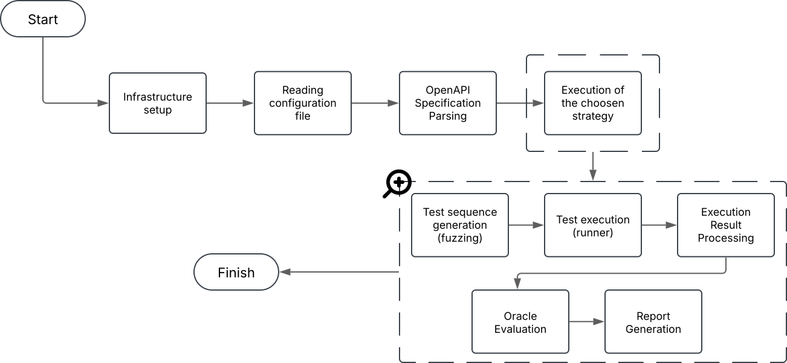

# Architecture

The architecture of RTG can be seen in the figure. It provides developers and researchers with two types of components. It is possible to find **core components** that work out-of-the box, and **extensible components** that can be re-implemented to give developers, or those who need them, the possibility of creating totally customised strategies. 
Core and extensible components are the basic building blocks for new testing approaches. Complete and functioning test strategies are already available in the framework as examples of how to instantiate and assemble all necessary components.


## Core Components
**Core components** are a collection of ready-to-use classes that a researcher may directly integrate into a testing strategy. The initial point of REST API testing in black-box mode is the OpenAPI specification. For this, a very robust **OpenApi Parser** is provided that is tolerant of certain inconsistencies that may be encountered. In this case, properties that do not belong to the grammar are silently ignored and inconsistencies are fixed where this is possible. For example, type conversion is attempted if there is no match (e.g. ```0``` instead of ```0```). Values that cannot be converted are ignored.

All the data that are parsed serves to construct an internal data structure that corresponds in a **list of operations** (```Operation```) that serves to represent the operations of the API that are described within the specification. Each ```Operation``` contains the endpoint, the HTTP method and the schema for the input/output data. 
Each schema is organised in a **```DataTemplate```**, a structure containing the names of the parameters, their types, their domain and, possibly, some constraints that may be expressed. Data Templates are hierarchical so they can either model atomic values or compound types.

Each test case that is executed may perform **several interactions** that are in a sequential relationship with each other. RTG provides a component called ```TestSequence``` that represents an ordered list of interactions. These are represented by a ```TestInteraction``` component, which contains all the information for testing an operation. The sequences are used by a ```TestRunner``` that is responsible for executing the various interactions. 

Selecting an **intelligent ordering** for the execution of the various interactions is of paramount importance because it means successful testing. To help researchers and programmers in this task, a component called **ODG** (***Operation Dependency Graph***) has been made available that captures **producer-consumer** relationships. Nodes represent operations, while direct arcs represent dependency. For instance, consider an operation ```A``` with an **input** parameter named ```p``` and an operation ```B``` with the same ```p``` parameter as **output**. In this case, the ODG will contain a directed edge **from A to B**, labelled with p.

The last core component is the ```Dictionary```. Dictionaries are made available to **store** and **retrieve values** observed during the testing of an API. A global dictionary captures all the values observed during a test session. It is also possible to have several local dictionaries that can store the values observed in a smaller set of Test Interactions.

## Extensible Components
**Extensible components** are a set of abstract and concrete classes for which researchers or experts might want to provide a new implementation to realise their new testing algorithm.

The ordering of operations, as mentioned before, is one of the crucial challenges for successful testing with a black box approach. RestTestGen provides ```Operation Ordering```, a component that is responsible for deciding the order of operations in a test sequence. The ordering of operations can be **static** (i.e. the ordering is performed before starting the execution of the ```TestSequence```) or **dynamic** (i.e. the order within the ```TestSequence``` is defined during the test execution as the next operation to be tested depends on the outcome of the previous ones). 

When a ```DataTemplate``` is instantiated, the ***Input Value Provider*** component takes care of generating or returning a relevant value for the parameter under consideration.
 RTG already contains some concrete **single-strategy** implementations of the Input Value Provider. They are:
- **Example Value Provider**: returns a random value from among the examples. 
- **Default Value Provider**: returns the default value of a parameter.
- **Dictionary Value Provider**: chooses a value from the dictionary, under the condition that a value for a parameter with the same name has already been observed in the test session.
- **Random Value Provider**: generates a random value based on the specification parameter pattern. 
- **Narrow Random Value Provider**: similar to the Random Value Provider, but some of the values are generated in a narrower range.   
- **Request Dictionary Value Provider**: chooses a value for the parameter from a dictionary of values used for successful requests (i.e. ```2XX status code```). 
- **Response Dictionary Value Provider**: chooses a value for the parameter from a dictionary of response values observed in previous interactions. 
- **Last Request Dictionary Value Provider**: is the same as the Request Dictionary Value Provider, but the value assigned to the parameter is the last one observed.   
- **Last Response Dictionary Value Provider**: is equal to the Response Dictionary Value Provider, but the value that is assigned to the parameter is the last one observed. 

In addition, the framework contains concrete **multi-strategy Input Value Providers** that combine several existing single strategies. These are:
- **Random Selector of Input Value Provider**: randomly chooses a single-strategy input value provider from those available and compatible for an input parameter.   
- **Enum and Example Priority Input Value Provider**: prioritise enum and example values as they are more likely to be effective, selecting them with high probability and selecting the remaining single-strategy providers with lower probability. 
- **Global Dictionary Input Value Provider**: priority is given to the use of a global dictionary. A global dictionary is defined as a dictionary in which all values observed during a test session are stored.   
- **Keep Last ID Input Value Provider**: the main objective of this strategy is to maintain and reuse the last observed ID value for a parameter.
- **Local Dictionary Input Value Provider**: priority is given to the use of a local dictionary. A local dictionary is defined as a dictionary within which values from a sub-set of Test Interaction have been stored.

Another important functionality that the framework provides is that of being able to change the input values for a given parameter. For this, a **Mutation Operator** is made available that can be redefined to create customised mutations. 

It is also possible to find the **Oracle** component. This component is responsible for **making decisions** on the correct execution of a ```TestSequence```. The result of an evaluation by an Oracle is a ```TestResult```, which can be: ```PENDING``` (i.e., if the test case has not yet been executed), ```PASS``` (i.e., if the test case has passed), ```FAIL``` (i.e., if the test case has failed), ```ERROR``` (i.e., if the test case has encountered an error during execution), ```UNKNOWN``` (i.e., if the oracle is unable to make a decision). Two oracles are already implemented in RTG: the **Oracle Status Code** and the **Oracle Schema Validation**. The first oracle classifies as ```PASS``` a test case whose HTTP response is ```2XX status code```; as ```FAIL``` when it receives a ```5XX status code```; as ```UNKNOWN``` if the response is a ```4XX status code``` because the error code is not informative enough for the oracle to make a decision.   

The second oracle, on the other hand, compares the content of an HTTP response with its pattern as defined in the specification. The test is classified as ```PASS``` if the response is valid with respect to the schema, otherwise as ```FAIL```.

Moreover, there is the **```Writer```** component. This is the component used to write test sequences to files. Within the framework, again, there are two implementations. In particular:
- **JSON Report Writer**:  issues the report of a test sequence executed on a file in JSON format, including the HTTP request and response of each interaction and the result of the oracle.
- **RESTAssured Writer**: outputs the automatically generated test sequence as a test case in Java, using the RESTAssured library. 

Finally, there is the **```Strategy```**. This is the **entry point** of the framework and represents the place where the business logic of the test strategy is to be implemented. A strategy consists of integrating the framework components, possibly after extending and/or customising them. 

## Execution Pipeline


To better understand the high-level operation, the tool's execution pipeline is provided. The image shows a schematic version of what happens at start-up. 
A more detailed version is given below. 

For the tool to work properly, it is necessary to configure it. This is done by **compiling** the ```rtg-config.yml``` file. In it, there are two properties to be provided:
- ```strategyClassName```: which indicates which strategy you wish to execute
- ```apiUnderTest```: which gives an indication of the REST API you wish to test. 

Then, when the tool is started, this configuration file is read and its information are **extracted**. Based on what is specified in it, a certain API will be taken into account and tested with a certain strategy. 
The next step, in fact, concerns the **parsing** of the OpenAPI specification of the REST API to be tested. From the parsing, all the information needed to proceed with the testing is extracted, such as the operations present, the parameters needed to execute the requests, and the format of the responses. 

Once the various pieces of information have been gathered, it is possible to start with the execution of the chosen strategy. In fact, according to what is specified in the configuration file, the corresponding strategy is **launched**. Its purpose is to create test sequences, i.e. sets of individual interactions. These sequences require the execution of a **fuzzing phase** before they are executed, in which the parameters required to perform an HTTP request are valorised through the use of Input Value Providers. 

After that, the various test sequences are executed. In particular, all individual interactions that are part of the sequence itself are executed. 
The results of this phase are then **processed** by a processor that, for example, may be responsible for saving the data in response within a dictionary or preparing the data to be processed by an oracle. 
Subsequently, the results from the execution of the various test sequences are processed by an **oracle** that takes care of determining the success or failure of the test itself. 

Finally, everything that happened during testing is converted into a **report** in order to provide a more human-readable mechanism that allows developers and researchers to better understand any problems that the REST API tested presents, and also to highlight any vulnerabilities. 