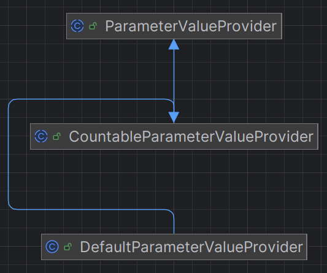

# Single Strategy
Individual strategies include the classes: ```DefaultParameterValueProvider```, ```EnumParameterValueProvider```, ```ExamplesParameterValueProvider```, ```LastRequestDictionaryParameterValueProvider```, ```LastResponseDictionaryValueProvider```, ```RequestDictionaryParameterValueProvider```, ```ResponseDictionaryParameterValueProvider```. They all extend the ```CountableParameterValueProvider``` class, which in turn extends the abstract ```ParameterValueProvider``` class. An example of a hierarchy can be found in the figure below.



In addition, we also have the ```RandomParameterValueProvider``` and ```NarrowRandomParameterValueProvider``` classes that directly extend the ```ParameterValueProvider``` class. An example of the hierarchy is shown in the figure below.


The ```CountableParameterValueProvider```  class extends ``` ParameterValueProvider```  and introduces the concept of a deterministic, finite source of values. Thus, parameter values are not generated randomly but are taken from a predefined and finite set.   
The class offers three ways of determining the source of values: 
- **```SELF```**: values are only taken from the specific instance of the parameter. 
- **```SAME_NAME```**: values are extracted from all API parameters that have the same name.
- **```SAME_NORMALIZED_NAME```**: values are extracted from all parameters that have the same normalized name, i.e. a name treated uniformly to avoid variations due to different formatting. 

The ```CountableParameterValueProvider``` class also implements methods to collect parameters with the same name or the same normalised name, to filter out duplicate values and to eliminate those that do not conform to the parameter specification. When a value is requested, the class determines which values are available according to the configuration and chooses an appropriate value. If there are no values available, an exception is thrown; if only one value is available, it is returned directly; if there are multiple values, one is selected randomly. 

At the base of the hierarchy is the abstract class ```ParameterValueProvider```, which defines a common interface for all value providers. Each instance of this class must implement the ```provideValueFor()``` method, which, given a parameter, returns a value that can be used in tests. The class also includes the variable ```strict```, which determines whether values are to be subjected to stricter conformity checks.